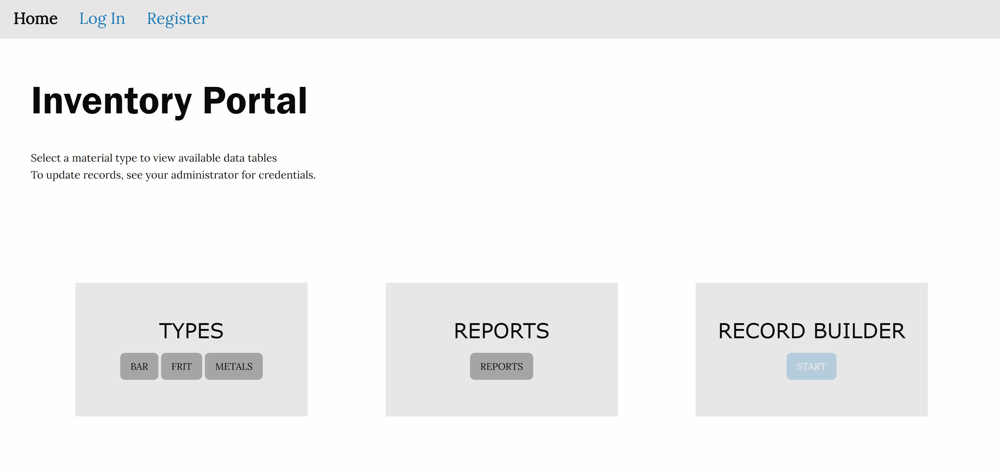
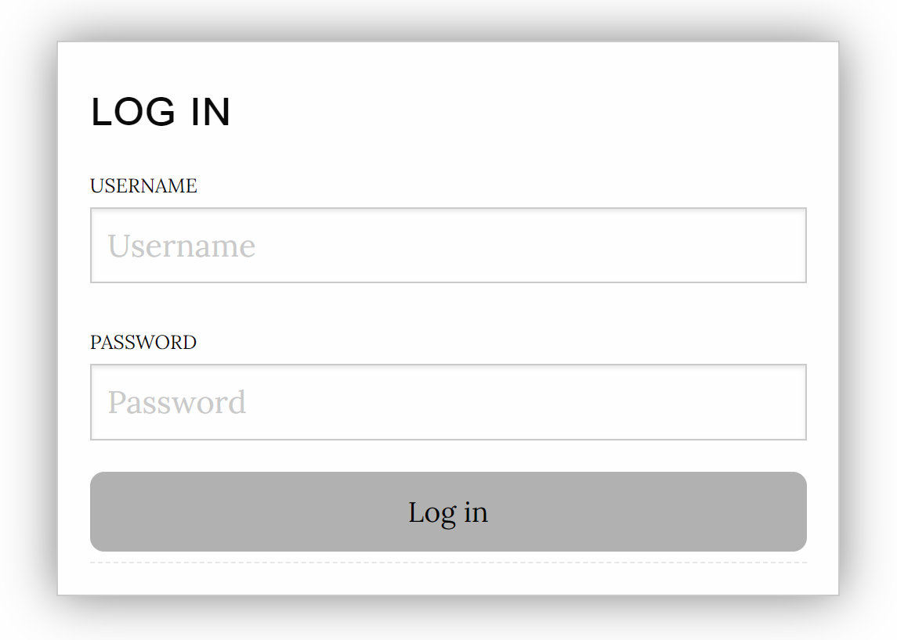
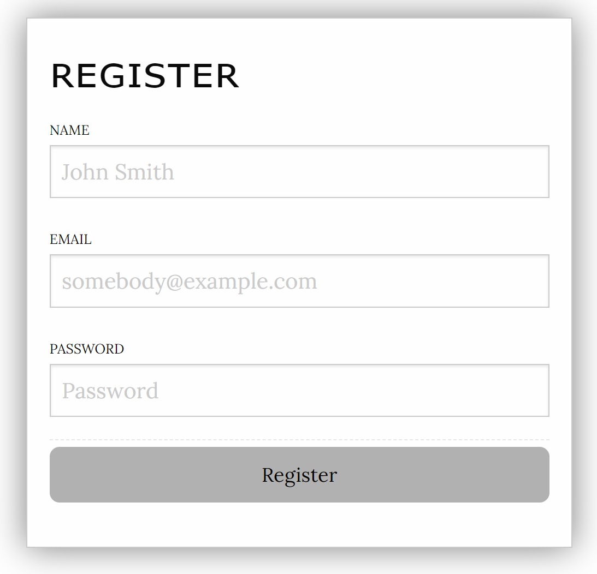

[![Contributors][contributors-shield]][contributors-url]
[![Issues][issues-shield]][issues-url]
[![MIT License][license-shield]][license-url]


<br />
<p align="center">
  <a href="https://github.com/jazznerd206/CH-inventory">
    
  </a>

  <h3 align="center">Inventory Portal</h3>

  <p align="center">
    An awesome way to keep track of materials!!
    <br />
    <a href="https://github.com/jazznerd206/CH-inventory"><strong>Explore the docs »</strong></a>
    <br />
    ·
    <a href="https://github.com/jazznerd206/CH-inventory/issues">Report Bug</a>
    ·
    <a href="https://github.com/jazznerd206/CH-inventory/issues">Request Feature</a>
  </p>
</p>


<details open="open">
  <summary>Table of Contents</summary>
  <ol>
    <li>
      <a href="#about-the-project">About The Project</a>
      <ul>
        <li><a href="#built-with">Built With</a></li>
      </ul>
    </li>
    <li>
      <a href="#getting-started">Getting Started</a>
      <ul>
        <li><a href="#prerequisites">Prerequisites</a></li>
        <li><a href="#installation">Installation</a></li>
      </ul>
    </li>
    <li><a href="#usage">Usage</a></li>
    <li><a href="#roadmap">Roadmap</a></li>
    <li><a href="#contributing">Contributing</a></li>
    <li><a href="#license">License</a></li>
    <li><a href="#contact">Contact</a></li>
    <li><a href="#acknowledgements">Acknowledgements</a></li>
  </ol>
</details>




## About The Project
<br>
> Hey!! You've found an inventory portal, congratulations. Before you go exploring, here are some things to know -- 
1. This particular portal was developed to handle data about materials used in production at a glass blowing studio. The material types __bar__ and __frit__ refer to the different styles of pigmentation used to augment clear glass, while the metal category holds data about the leaves and foils that are use decoratively on the surface.
2. You may notice that some of the buttons are disabled if there is no user logged in. This is because while anyone needs to be able to look up a material to see if there is any in stock, only people with certain privileges should be allowed to update the database. To that end, the record builder and all add/remove/delete functionality from the tables has been disabled unless there is a user logged in.
3. You may also notice that there is not much data saved in the portal right now. What you are seeing is a guest version of the portal, feel free to register and build records or update records currently in place. You will not affect any production data.

Here's why:
* Every year, I was in charge of delivering an updated inventory of materials on hand at the studio I worked at. That entailed 5-6 employees taking 5 days to count everything, then another couple days for me to aggregate those numbers into a spreadsheet to send to the office.
* By creating a database that can keep a rolling total of inventory bought and used, a large portion of the labor hours spent counting could be saved.
* By tracking daily usage, we can generate information and reports about how much of a certain material is used in a certain product.


#### Built With
* [NodeJS](https://nodejs.org)
* [Express](https://expressjs.com)
* [Handlebars](https://handlebarsjs.com/)
* [Materialize CSS](https://materializecss.com/)
* [Passport JS](https://passportjs.org)
* [Mongoose](https://mongoosejs.com)
* [MongoDB Atlas](https://docs.atlas.mongodb.com/)


## Getting Started

In order to run this portal locally:

### Prerequisites

1. Node JS
2. Modern Browser

### Installation

1. Obtain repo link from Github
2. Clone the repo
   ```sh
   git clone https://github.com/your_username_/CH-inventory.git
   ```
3. Install NPM packages
   ```sh
   npm i
   ```
4. DATABASE CONNECTION:
  * Create database named 'inventory' for local environment
  * If hosting, you must create [MongoDB Atlas account](https://www.mongodb.com/cloud/atlas/register) and configure cluster URI on hosting network
  ```
    let MONGODB_URI = process.env.MONGODB_URI || "mongodb://localhost/inventory";

    mongoose.connect(MONGODB_URI, { useNewUrlParser: true, useUnifiedTopology: true  }, (error) => {
      if (!error) {
        console.log("Connected!");
        app.listen(PORT, function() {
          console.log('listening on port ' + PORT + ' db: ' + MONGODB_URI);
        });
      }
      else {
        (console.log('mongoose error: ' + error))
      };
    });
  ```
## Usage

### LOGIN/REGISTER
 

### VIEW/UDPATE RECORDS

### CREATE NEW RECORD

### VIEW REPORTS

[contributors-shield]: https://img.shields.io/github/contributors/jazznerd206/CH-inventory.svg?style=for-the-badge
[contributors-url]: https://github.com/jazznerd206/CH-inventory/graphs/contributors
[issues-shield]: https://img.shields.io/github/issues/jazznerd206/CH-inventory.svg?style=for-the-badge
[issues-url]: https://github.com/jazznerd206/CH-inventory/issues
[license-shield]: https://img.shields.io/github/license/jazznerd206/CH-inventory.svg?style=for-the-badge
[license-url]: https://github.com/jazznerd206/CH-inventory/blob/master/LICENSE.txt
